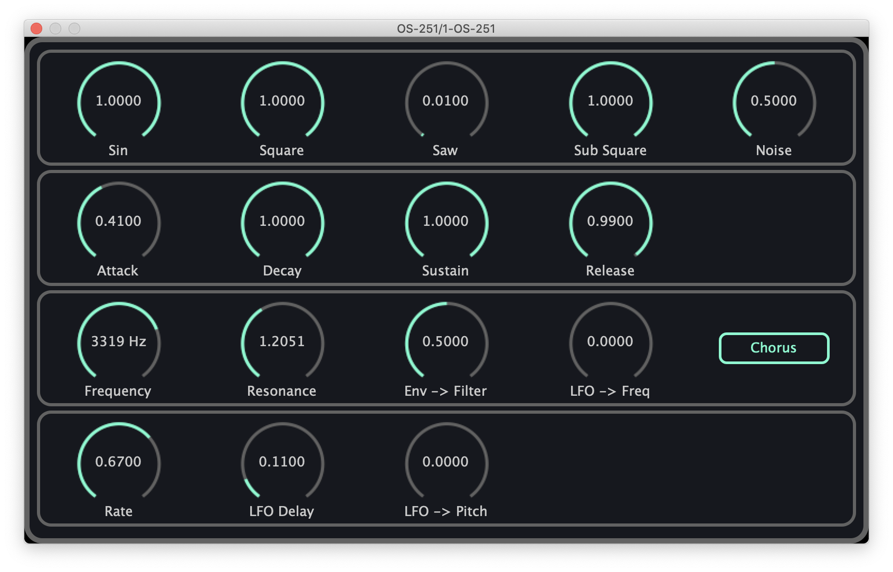

# OS-251
OS-251 is a synthesizer plugin (vst3, au) made with C++ , JUCE and react-juce.

This plugin is currently under development.

## TODO

### Quality

- [ ] Improve sound
- [ ] Improve UI/UX

### Functionality

- [ ] Add "About" to UI
- [ ] One knob HPF
- [x] LFO -> Shape parameter
- [x] Master pitch setting (3 knobs)
- [x] Pitchbend width setting
- [ ] Presets
- [ ] (Optional) Make LFO sync with the host's tempo.
  Maybe "Sync ON" button and "Phase" knob will be added.
- [ ] (Optional) Tempo LFO re-triggered by MIDI notes ("retring").
  Maybe "Tempo ON" button and "Phase" knob will be added.
- [ ] Allow to change number of voices
- [ ] Unison
- [ ] Portamento
- [ ] "ENV or GATE" switch for VCA
### Tools

- [ ] Add lint tool for javascript
- [ ] Move to Typescript
- [ ] Lint check in CI
- [ ] Create installer in CD
- [ ] CI/CD for Windows and Linux