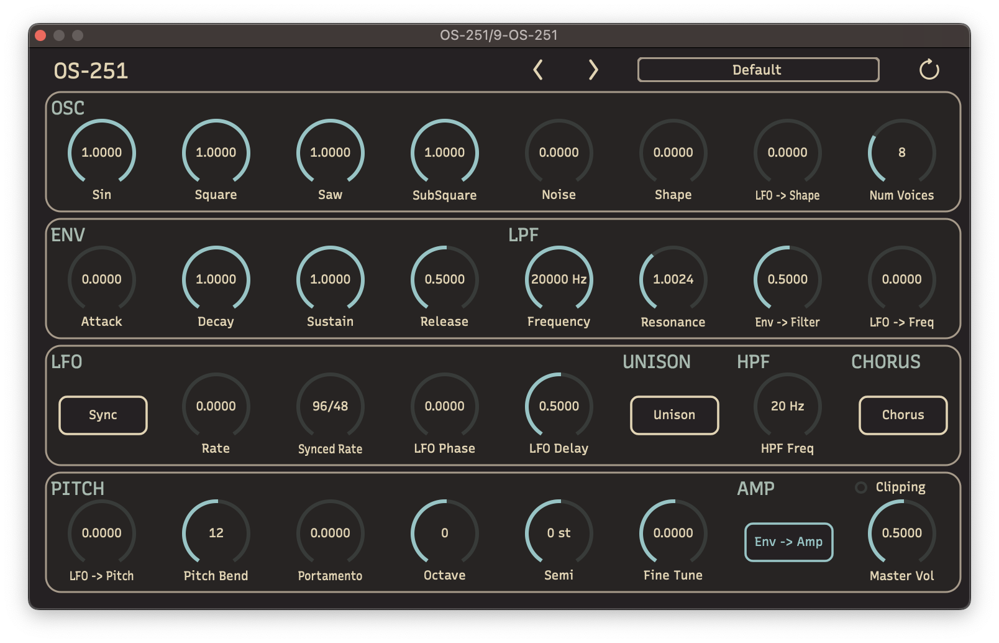

# OS-251
OS-251 is a synthesizer plugin (vst3, au) made with C++ , JUCE and react-juce.

This plugin is currently under development.

<div align="center"></div>

## Lint

### Mac

```bash
# Fix C++ code formatting
$ find -E . -regex '^\./src/.*\.(cpp|h)$' -not -path './src/jsui/*' | xargs clang-format -i

# Check C++ code formatting (dry run)
$ find -E . -regex '^\./src/.*\.(cpp|h)$' -not -path './src/jsui/*' | xargs clang-format -i --dry-run --Werror
```

### Linux

```bash
# Fix C++ code formatting
$ find . -regex '^\./src/.*\.\(cpp\|h\)$' -not -path './src/jsui/*' | xargs clang-format -i

# Check C++ code formatting (dry run)
$ find . -regex '^\./src/.*\.\(cpp\|h\)$' -not -path './src/jsui/*' | xargs clang-format -i --dry-run --Werror
```


## TODO

### Quality

- [ ] Improve sound
- [ ] Improve UI/UX

### Functionality

- [ ] Add "About" to UI
- [x] One knob HPF
- [x] LFO -> Shape parameter
- [x] Master pitch setting (3 knobs)
- [x] Pitchbend width setting
- [ ] Presets
- [x] (Optional) Make LFO sync with the host's tempo.
  Maybe "Sync ON" button and "Phase" knob will be added.
- [ ] ~~(Optional) Tempo LFO re-triggered by MIDI notes ("retring").~~
  ~~Maybe "Tempo ON" button and "Phase" knob will be added.~~
- [x] Allow to change number of voices
- [ ] Unison
- [x] Portamento
- [x] "ENV or GATE" switch for VCA

### Tools

- [ ] Add lint tool for javascript
- [ ] Move to Typescript
- [ ] Lint check in CI
- [ ] Create installer in CD
- [ ] CI/CD for Windows and Linux
